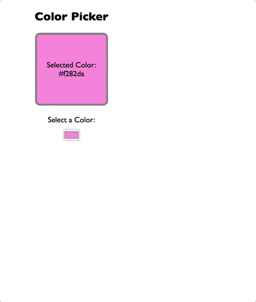

# Project2: color picker app

Main points：useState() build a stateful var: color, onChange={handleColorChange}
so when user changes color input, will need to update and show real changes in the color board
element: `<input type="color" value={color} onChange={handleColorChange}>`
element2: colorDisplayBoard -> a div, style setting `
`

#### A simple Demo: please Enjoy the show !

