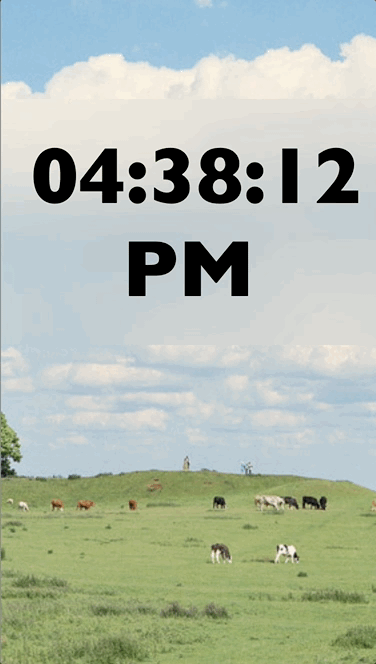

# digital clock, update when time updates.
1. in JS, we have to setInterval 
2. in react, we could `include setInterval into : useEffect()`, to define when it should run (when the component mounted)

- key note: which will be in the useEffect
  
  1. inside the useEffect(), we would like to setInterval(updateDisplay, 1000) every 1000ms or every 1s. 
  2. inside the useEffect(), we would like to `clear the intervalId` once the component unmounted from the react DOM

3. we could define a function to get hour, minutes, and seconds, and return the final string , later we can pass to html tag this method by {method()}
4. should define a `time state`, and update the time every 1000ms through the setInterval function

#### Digital Clock App illustration: enjoy ☕️ ！！
