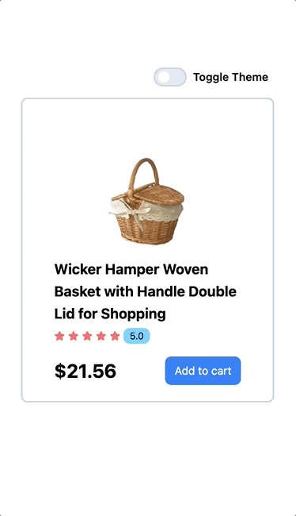

# 30: themeswitcher
applying another useContext with custom hook

inside one .js file, do three stuff.
1. createContext, define some content inside the ({}), export the context 
2. create a contextProvider = context.Provider, and export the contextProvider
3. export a useContext(contextname) function 

note: classList.remove("a", "b", "c") if you want to remove multiple values

#### a good card project with theme switcher button. Enjoy ☕️ ~~
