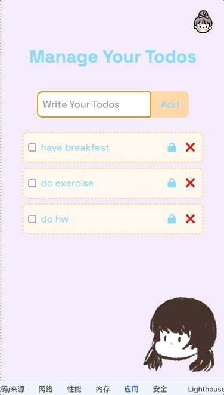

# todolist , react context api for local storage

### local storage: after the page load, create the local storage, get the data,
push the data into the state
through useEffect(callback, [])


  1. local storage in the web page loaded. so when the page reloaded or refresh at the beginning. will save the data 

  ```
  useEffect(() => {
    // JSON.parse => convert the string to object !! yes. if any list items existed in the last session, then: just parse it into json and add it into the todos.
    const todos = JSON.parse(localStorage.getItem("todos"))
    if (todos && todos.length > 0) {
      setTodos(todos)
    }

  }, [])
  ```

  2. whenever todos updated, run this function to save the todos into the local storage. but localStorage only accept the string format, so need to stringify the object

  ```
  useEffect(() => {
    localStorage.setItem("todos", JSON.stringify(todos))
  }, [todos])

  ```


### for className do the conditional rendering and adding some function

way1: must use the `` because it is the .js 
className={`some css ${functions that return some css strings}`}

way2: className={'some css ' + (some functions that return css strings)}

note: inside the return html, `{all of them are .js code}`


### for checkbox to update the completed attribute based on checked attribute: true or false
set value = {td.todo}, onChange will decide whether it is changed. onChange(run toggleComplete)

### for input to lock and unlock editable
combine readOnly={!td.editable} onChange={updateTodo function}


### for button to be disabled
disabled={some true/false condition or functions}

### if you want to define a context, put all createContext, contextProvider, and useContext together in one file. and define a index.js to put all different context file together. so you can later on import all those things based in one index.js file in the context folder

similarly, if you want to use different components.jsx, simply write diffent .jsx file in the components folder and aggeragate them in the one index.js file by import and export all of them


#### TodoList demo with theme Switcher and Context API to store data temporily, Enjoy the show ☕️～～
