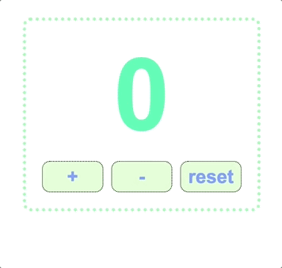

# Lesson 8: react Hook
react hook = special function that allows functional components to use React features without writing class components (React v16.8) (if a function name starts with a use, it is likely to be a react hook: useState, useEffect, useContext, useReducer, useCallback, and more)

#### useState() = A react hook that allows the creation of a stateful variable AND a setter function to update its value in the Virtual DOM
```
 import React, {useState} from 'react'
 const [name, setName] = useState();
```

if you want to update a stateful variable, you can only use setName() function . with this function, you can `update and save the new value in state. and rerendering the page whenever the state updated.`

that means we no longer need to write a class component, we just need to use functional based components that use hooks to use react fetures


#### Counter Program Demo: Enjoy ☕️


