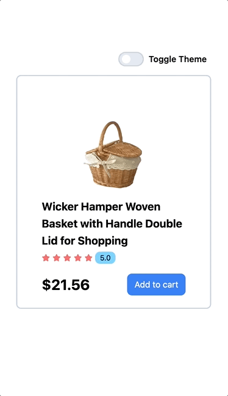

<h2>React: a JS Library that allows user to build an user interface out of individual pieces called components. </h2>
There are React components like Thumbnail, LikeButton, and Video. Then combine them into entire screens , pages, and apps

`component`: self-contained section of code that functions as a reusable building block. components are function-based .jsx file ，we can export the component so that it can be reused one or more times.

`JSX`: React uses a syntax extension of JavaScript known as jsx (meaning JS XML)
`, which allows you to write and return html within JS (a file that includes html elements) `

`virtual DOM`:
React also ulitize a virtual DOM (a lightweight version of the real DOM of a web page)
we can track any changes made to the virtual DOM and only apply that specific change to the real DOM without needing to refresh the entire web page (like live loader in VSCODE, but only update the changing part instead of the entire webpage!!!)

`React Project Required`: JS, HTML, CSS, Node.js (`a backend JS runtime environment` and it executes JS code outside of a web browser. we are interested in its package manager: `npm`), vscode

Intalled Path:
• Node.js v22.0.0 to /usr/local/bin/node
• npm v10.5.1 to /usr/local/bin/np

#### Create a vite react project:

1. inside vscode -> open terminal (ctrl + `) -> type

```
npm create vite@latest
```

note: `vite: a development server`. it is a modern replacement to create a react app, which a now outdated. vite allows you to create a project, enter a name, select a framework, a variant (JS or TS or +SWC)

vite helps you create this project folder with your selected framework within this folder (mine is my-react-app)

2. Now, run

```
  cd my-react-app
  npm install
  npm run dev
```

#### Contents created by vite bundler:

Inside `<my-react-app>` folder:

1. `node_modules`

   -- contains external library and packages that our projects relies on

2. `public`

   -- contains any public assets

   -- can contains public fonts, images, videos ``` (generally available via a url)

3. `src `

   -- assets: contains static images and videos. the items inside the assets will be bundled in the output

   -- other main react components shown in the web dev interface written in the .JSX ,and applied the .css styling. (e.g. the opening page with Vite and React maining written in App.jsx and applying styling in App.css. they are imported and shown in main.jsx. Inside the main.jsx, we have our vitual ROM: in the virtual ReactDOM, we create a root element, which shown in the "index.html" file, and show our App component)

   -- if you want to create a new component, you can create .jsx inside the src folder ❤️ (or create a components folder inside the src folder)

   -- adding some custom hooks or context (.js file)

4. `index.html` file apply src .jsx script and package.json file write the meta data used for this project

Conslusion: `react is JS libraray that allows user to create components for reuse purpose!!`. components reside in src .jsx files, which is a JS function that can include both (JS components and html tag elements). The components can be exported as a html element, that make this component reusable!!

#### Component.jsx syntax

```
syntax:
  function FuncName(){
    return(
      // only one html tag, but inside this tag, we can include lots of children tags
      // if you want to return multiple <tag> components, try to wrap them into an one big <></> tag
    );
  }
  export default FuncName

```

then we can import this components in other .jsx and use it in our main.jsx and display it as a component in our web page.
TO reuse,

```
1. import FuncName from `./file.jsx`;
2. <FuncName></FuncName> or <FuncName />
```

---

The following knowledge from another video: lecturer: Hitesh Choudhary

1. how to start a react project: recommended using a framework like next.js, Remix, Gatsby ``` or a bundler : vite
2. package manager: npm vs npx, what's the difference?

- `npm`: node package manager: to install and uninstall, and update the JS packages on the worstation
- `npx`: node package executor (helps you to directly execute the packages without installing them)

1. using npx (traditional method, default react):

```
npx create-react-app foldername
```

2. using npm and bundler(vite):

```
npm create vite@latest
```

by running the code:
vite create a folder but `haven't put anything` in the folder yet, like librarirs and modules, we have to cd the folder, run

```
cd folder
npm install
// based on the file: package.json to install the modules and lib
npm run dev
```

The folder full structure dipdown (check package.json):

1. React (alone doesn't work)
2. React-dom api (let you render React components on the client (in the browser), for generating a DOM, web app)
3. react-native (mobile app)
4. others (like 3D app)

The difference between using `create-react-app` vs `vite react project` to create react project：

1. dependencies:

   - vite doesn't contain essential libraries, eg. no `react-scripts`, only just react and react-dom

2. running scripts (they have different running scripts in the package.json):

   - for create-react-app:

   ```
   npm run start
   npm start
   ```

   - for vite:

   ```
   npm run dev
   ```

3. src:

   - in the react app: files are `.js` files
   - in the vite app: files are `.jsx` files (`if you return any html from js, then called .jsx`; another convention: component .jsx file, we usually use `Capitalized naming convention`)

4. injecting scripts
   - react default: using react-script and inject the script outside of index.html
   - vite: put `<script> </script>` inside the index.html

react: seems everything as an object. we can use {} a dict to represent it

```
const reactElement =
{
  type: 'a', // any html tag you want
  props: {
    href:"www.youtube.com",
    target: '_blank',
  },

  children: 'Click me to visit google',
}
```

but react doesn't recognise the key you give to the object, so you have to convert it into a html element or using react language.

<h4>state puzzle: </h4>

puzzle 1: state update -> re-render the page

1. when using useState, you can create a state variable, which can be automatically updated in the return html {state var}

2. when declare a variable using let variable = ; then write a function to update it manually, it cannot be updated in the html tag when clicking on the button (reference: counter program , and 23-statepuzzle)， even though js can allow you to increment counter in the console but react can not make the updated counter displayed，since react is UI library，which required re-rendering page and thus state update.

`state`: any change on the state will re-render on the UI, so the screen will be updated is a state variable changes. and simply declare a variable through let , cannot get a state variable, which when updating, cannot trigger a UI re-rendering

`useState`: a method to create a state variable and setState() method to update the state variable
syntax:

```
import React, {useState} from 'react';

[statevar, setState] = useState();
```

puzzle2 : state batching
a phenomenon showing that when you setState() for multiple times together, they will rely on the original state variable value to update (batching the change all together)

```
function addCount(){
  setCounter(counter + 1);
  setCounter(counter + 1);
  setCounter(counter + 1);
  setCounter(counter + 1);
}

// note: the result will not be counter + 4; instead, it will be counter + 1 when clicking the button. this will bundle everything together. the solution: using an updater function or a callback function or an arrow function. they are depending on the prevCounter instead of current Counter value

function addCount(){
  setCounter((prevCounter) => prevCounter + 1);
  setCounter((prevCounter) => prevCounter + 1);
  setCounter((prevCounter) => prevCounter + 1);
  setCounter((prevCounter) => prevCounter + 1);
}
```

<h3>React Virtual DOM, React fiber Architecture</h3>

`react virtual dom` mimic the true DOM.

`React Fiber` is an ongoing reimplementation of React's core algorithm. The goal of React Fiber is to increase its suitability for areas like animation, layout, and gestures. Its headline feature is `incremental rendering`: the ability to split rendering work into chunks (updated work in batching model) and spread it out over multiple frames。
Other key features include the ability to pause, abort, or reuse work as new updates come in; the ability to assign priority to different types of updates; and new concurrency primitives.

prerequisites knowledge:

- React Components, Elements, and Instances - "Component" is often an overloaded term. A firm grasp of these terms is crucial.
- Reconciliation （react 用于区别一个 DOM 和另一个 DOM 的算法，帮助决定哪一个 DOM 的部分需要被改变。 React API 的核心思想是更新 updates -> 就类似于整个 app 的 re-render 一样，但是 rerender 整个 app 有时候非常昂贵要付出表现的代价。而 react 的优化能够权衡两者，给予让页面 rerender 的方式又能保持整体的网页 app 表现。这个部分的优化也是一部分的协同）, `协同算法是基于virtual DOM的理解，当render一个react app的时候，一棵树的所有nodes来描述这个app会形成并且保存在内存中，然后这棵树会被冲到rendering的环境中（比如在网页app中，他会被翻译成一系列的DOM 操作“ 。 然后当app被更新updated（通常通过setState），新的树会被生成，新的树和之前的树不同，来计算什么操作对于app需要被更新`

  - 不同的组成 component types 被假设产生可持续的不同的树，react 不会想要 diff 他们，而是完全替代 old trees
  - lists items 需要不同的，稳定的可以预测的 unique keys

- update: A change in the data used to render a React app. Usually the result of `setState`. Eventually results in a re-render 数据的改变用于 render 更改一个 react app，通常是更新状态的公式结果，导致一个页面的更新。
- reconcilation vs rendering: DOM 也就仅仅是其中一个 react 可以 render 的 rendering 环境，其他主要的目标是 native IOS 系统和 Andrid views，还有 react-3D-rendering 通过 react native。react 的设计将协同和 render 区别开，分开进行，先进行 reconcile（计算树的那个部分已经发生了改变），然后 rerender （使用前者的信息进行实际 update rerendered app). 这个分离让 React DOM 和 React Native 可以使用他们自己的 rerenders 同时共享同样的 reconciler （通过 react core 提供）
- React Basic Theoretical Concepts - A description of the conceptual model of React without implementation burden.
- React Design Principles:

  - scheduling: 这个过程决定了何时工作需要被表现，
  - work：任何需要被表现的计算，通常是一个 update 的结果
    react 的设计遵循指导有必要的时候，计算才会被执行，之前可以被存储起来不是任何的新数据来的时候都要进行计算的。 react 不是一个简单的数据处理的 library ，而是一个用于建立 UI 用户界面的 library。应用场景：If something is offscreen, we can delay any logic related to it. 如果什么从页面上消失，我们可以延迟关于这些逻辑的 rerendering， If data is arriving faster than the frame rate, we can coalesce and batch updates. 如何数据到达的速度快于贞速，我们可以合并更新 We can prioritize work coming from user interactions (such as an animation caused by a button click) over less important background work (such as rendering new content just loaded from the network) to avoid dropping frames. 我们可以优先处理来自和用户进行互动的更新工作，将其他更不重要的更新工作比如背景工作延后（比如 rendering 新的内容）来避免缺失的贞
  - 重点：

  1. 在一个 UI 用户界面中，没有必要每一个更新都必须立即被应用，如此这般会比较的浪费，导致贞丢失，降低用户体验
  2. 不同的 updates 更新种类有不同的优先级 - 一个动画的更新需要完成的比起数据存储更新更快
  3. A push-based approach requires the app (you, the programmer) to decide how to schedule work. A pull-based approach allows the framework (React) to be smart and make those decisions for you. 当前 react 没有特别利用 scheduling，更新于整个子树的结果会被理解的 rerendered，这也就造成了整修 react core 的算法来利用 scheduling 的优势是驱动 Fiber 的主要驱动力

`Fiber architecture 理解`：Fiber 的主要目标就是让 react 能力更好的利用 scheduling 的能力，实现：

1. pause 暂停更新工作 work，之后再回来 （pause work and come back to it later.）
2. 对不同种类的工作分配不同优先级 （assign priority to different types of work.）
3. 重新利用 reuse 之前完成的工作 （reuse previously completed work）
4. abort 丢弃不需要的工作 （abort work if it's no longer needed.）
   为了做好上述，需要一种方式将 work 分离成为 units 单位，fiber 就是 a unit of work

`fiber components` = functions of data 成分是数据公式，所以 rendering 一个 react app 就类似于 calling a function 召唤一个公式（包含其他公式），在这种方式下，计算机追踪一个程序的执行 = using call stack ，当一个公式被执行，一个新的 stack frame 被增加到栈中，这个 stack frame 表示需要被这个 function 所表现的 work。
当处理 UIs 的时候，问题就是：他们的工作需要被同时一次性执行，造成 animations 掉帧看起来缺漏，特别是有一些工作可能没有必要因为她被一些更新的更新所替代了。这是为什么 UI components 和 function 之间的类比 breaks down，因为成分具有更细分化的 concerns 但是 functions 更新总体化。

更新的浏览器和 react 原生执行 APis 帮助解决这个问题：requestIdleCallback schedules 更低的优先级更是，被 call 在 idle 空闲时期，requestAnimationFrame schedules a high priority function 更高的优先级，被执行在下一个 animation frame。但是为了使用这些 APIS，需要一个方式来将 rendering work 分离成为 incremental unit （不仅仅只依赖于 call stack），因为这样的设计能自定义 call stack 执行任务的顺序 来优化 rendering UIs 的表现，而不是从前那样来一个 function 入栈，然后按照顺序 call function 了。 而 fiber 的目的就是在于此（重新实时 stack，专注于 react components, 可以将一个 fiber = 一个虚拟的 stack frame）。

这样的设计（多个 react components，多个 stack frames）让我们能在内存中追踪 stack frame 而等到想要的时候再去执行他们，这对于 scheduling 和优先任务先后执行非常重要。除了 scheduling 之外，手动的处理 stack frames 解锁了其他潜在特征比如共时性`concurrency` 和 错误边界 `error boundaries`

`fiber 就是react component =  a JavaScript object that contains information about a component, its input, and its output. A fiber corresponds to a stack frame, but it also corresponds to an instance of a component.` fiber 的重要 fields：

- type : 描述一个成分对应着什么，复合成分 type = 一个公式 function/class component 他自己，对于 host components（比如 div span 等等），type 就是一个 string
- key：在 reconciliation 的时候被用于决定是否 fiber 可以被重新的利用
- child & sibling: 描述其他的 function / fibers，描述一个 fiber 的递归树结构. child fiber will be returned by a parent fiber or function。sibling fibers are mutliple children list returend by a fiber. 一个孩子的其他 siblings，child fibers 会形成一个单链表，head 时 child1，sibiling of child1 = child2

  ```
  function Parent()
  {
    return <Child /> // this is a fiber or another function
  }

  function Parent() {
  return [<Child1 />,   <Child2 />] // these are sibling fiber when render returns 多个fibers
  }
  ```

- return fiber = Parent fiber = after calling another fiber and return to this function (return address of a stack frame)
- pendingProps and memoizedProps: `Props 是 一个function的arguments`（passed in the function params and child fibers), 一个 fiber 的 pending Props 被设置在开头，memorized Props 被设置在结尾，当进入的 pendingProps =memorized Props 表示之前的 output 可以被重复使用，阻止无用的工作
- pendingWorkPriority： 这一个一个数字表示在 fiber 中的 work 的优先级
- alternate:

  - flush: flush a fiber 表示 render 他的 output 到屏幕上
  - work-in-progress: a fiber 会没有被完成，意味着一个 stack frame 还没被 returned
    任何时间，一个成分 component instance 最多拥有两个 fibers 对于它，一个是 flushed fiber, 一个是 work-in-progress fiber
    一个 fiber 的 alternate 通过一个公式 cloneFiber 懒惰建立，不是总呀创建一个新的 object，cloneFiber 尝试 reuse fiber's alternate 如果他存在的话，最小化分配

- output:returned host components or leaf nodes of react app (just a return value of a function), 记住：每一个 fiber 都会有一个 output，但是只有被 host components 创建的 output 才会被放在 leaf nodes 上，然后 output 会被转化到树上。output 是最终会被给予到 renderer，允许他最终 flush changes to rendering environment 实现这些更新

#### `Tailwind css `

tailwind css is a css framework which allows you to customize css styling sheet in a more convenient way. (A utility-first CSS framework packed with classes like flex, pt-4, text-center and rotate-90 that can be composed to build any design, directly in your markup.

#### `custom hooks & reuable components `

custom hooks: can be put in the hooks folder. they are .js file that return some values.

reusable components: those are .jsx files that will return a html element like a puzzle piece for completing the whole picture. the key is to decide the props for the components so that it can be customized based on the base component

#### `react routing`: different pages will route to different urls

#### `useContext`: parent components passing parameters or data to children components

1. passing props way down to the specific child by travelling from the top to the bottom (but it will make code messy and some middle components don't need to use that props)

2. state management. all variables can be separately put into another stack , so that anytime when a component wants to get a certain prop, it can directly get it from that stack. this stack is called `context`
   all the children components will be able to access to this context, they can also update values in the centralized context

```
process:
start --
       |
       create a react App -
                           |
                          create a Context
                           |
                          provide the Context(create a Context Provider to feed this Context)
                           |
                          Consume the Context in
                          Child Components
                          |
                          End
```

## Finally, Some react projects display: ENJOY ☕️ ~~~

   
        
   
  
 
  
  
 
  
  

