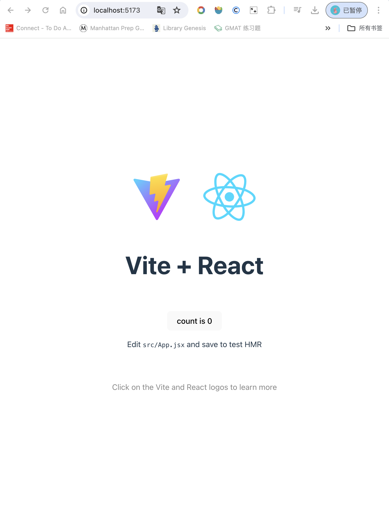

# class 1: intro to react

<h1>React: a JS Library that allows user to build an user interface out of individual pieces called components. </h1>
There are React components like Thumbnail, LikeButton, and Video. Then combine them into entire screens , pages, and apps
<h2>component: self-contained section of code that functions as a reusable building block. components are function-based 成分是以方法定义的（.jsx file 中定义），我们定义一个方法然后export这个方法就能作为成分reuse了</h2>

<h2>React uses a syntax extension of JavaScript known as jsx (meaning JS XML)</h2>
jsx: allows you to write html like JS code within JS 

<h2>React also ulitize a virtual DOM (a lightweight version of the real DOM of a web page)</h2>
we can track any changes made to the virtual DOM and only apply that specific change to the real DOM without needing to refresh the entire web page (like live loader in VSCODE, but only update the changing part instead of the entire webpage!!!)


Required: JS, HTML, CSS, Node.js (a backend JS runtime environment and it exercutes JS code outside of a web browser. we are interested in its package manager: npm), vscode

Intalled Path:
 	•	Node.js v22.0.0 to /usr/local/bin/node
	•	npm v10.5.1 to /usr/local/bin/np

inside vscode -> open terminal (ctrl + `) -> type 'npm create vite@latest'

<h4> vite: a development server. it is a modern replacement to create a react app, which a now outdated. vite allows you to create a project, enter a name, select a framework, a variant (JS or TS or +SWC) </h4>
vite helps you create this project folder with your selected framework within this folder (mine is my-react-app)

Now, run

  cd my-react-app
  npm install
  npm run dev



Inside <my-react-app> folder:
1. node_modules
   -- contains external library and packages that our projects relies on
2. public
   -- contains any public assets
   -- can contains public fonts, images, videos ``` (generally available via a url)
3. src 
   -- assets: contains images and videos. the items inside the assets will be bundled in the output 
   - other main react components shown in the web dev interface written in the .JSX ,and applied the .css styling. (e.g. the opening page with Vite and React maining written in App.jsx and applying styling in App.css. they are imported and shown in main.jsx. Inside the main.jsx, we have our vitual ROM: in the virtual ReactDOM, we create a root element, which shown in the "index.html" file, and show our App component)
   - if you want to create a new component, you can create .jsx inside the src folder ❤️

4. .html file apply src .jsx script and package.json file write the meta data used for this project


Conslusion: react is JS libraray that allows user to create components for reuse purpose!!. components reside in src .jsx files, which is a JS function that can include both (JS components and html tag elements). The components can be exported as a html element, that make this component reusable!!
syntax: 
  function FuncName(){
    return(
      // only one html tag, but inside this tag, we can include lots of children tags
      // if you want to return multiple <tag> components, try to wrap them into an one big <></> tag
    );
  }
  export default FuncName
then we can import this components in other .jsx and use it in our main.jsx and display it as a component in our web page.
TO reuse, 
1. import FuncName from `./file.jsx`;
2. <FuncName></FuncName> or <FuncName />